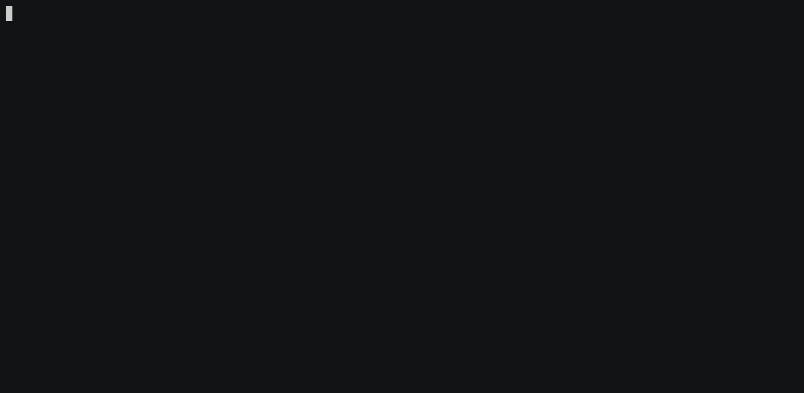

## Small Shell Console

C based project to build a unix shell.

---------------
1. Change the permissions on the test script `chmod +x ./p3testscript`
2. Run `make clean` to clean the directory then `make` to compile the executable
4. To run the test script run `make test`
---------------

Preview: 

# Author: 
Jared Connor - connorja@oregonstate.edu